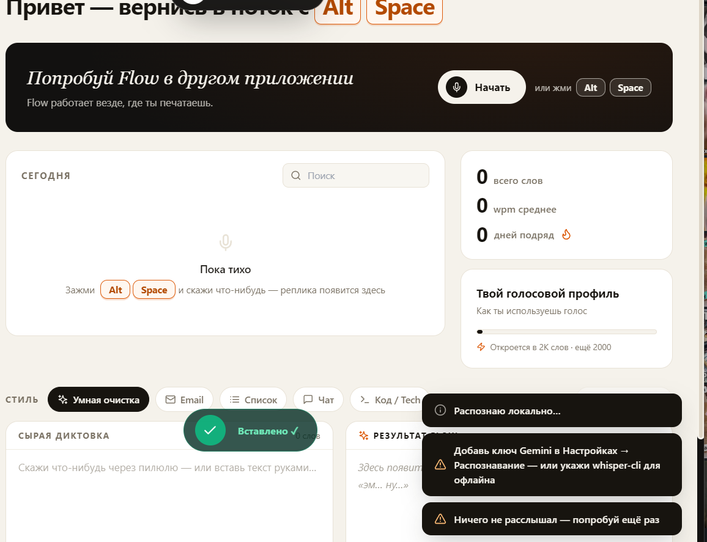

# 🎙 1mesto Flow — клон Wispr Flow (Hackathon Edition)

> **Не печатай. Просто говори.** Рабочая копия [Wispr Flow](https://wisprflow.ai):
> мгновенная диктовка (голос → грамотный текст), умная очистка речи от слов-паразитов,
> голосовые команды пунктуации, офлайн-распознавание whisper.cpp, живая волна и WPM-аналитика.

[](https://github.com/veberonin/1mesto.ai/actions/workflows/ci.yml)
**Лицензия: MIT** (Z-04) · **🌐 Живое демо (без установки): [veberonin.github.io/1mesto.ai](https://veberonin.github.io/1mesto.ai/)**


Веб-версия: Chrome/Edge + интернет. Десктоп-приложение работает офлайн (whisper.cpp).

Готовишься к оценочному стенду? → [docs/STAND_DEMO.md](docs/STAND_DEMO.md) — чеклист и сценарий на 90 секунд.

## ⚡ Быстрые команды

```bash
npm test            # тесты одной командой (node --test tests/)
npm run test:ui     # SSR-дым всех экранов (vitest, веб + десктоп-ветки)
npm run bench       # микробенчмарк форматтера (ops/sec, p50/p95)
npm run app         # собрать и запустить десктоп-приложение
```

Установка одной командой: macOS/Linux —
`curl -fsSL https://raw.githubusercontent.com/veberonin/1mesto.ai/main/scripts/install.sh | bash`
Windows (PowerShell) — `irm https://raw.githubusercontent.com/veberonin/1mesto.ai/main/scripts/install.ps1 | iex`

## ⬇️ Скачать приложение (AH-01)

Готовые установщики — на странице [Releases](https://github.com/veberonin/1mesto.ai/releases/latest):

| ОС | Файл | Действие |
|---|---|---|
| Windows 10/11 | `1mesto-Flow-Setup-3.0.0.exe` | Запусти → Далее → Готово. SmartScreen: «Подробнее → Выполнить в любом случае» (сборка без подписи) |
| macOS 12+ | `1mesto-Flow-3.0.0.dmg` | Открой dmg → перетащи в Applications. Первый запуск: правый клик по иконке → «Открыть» |
| Linux | `1mesto-Flow-3.0.0.AppImage` | `chmod +x *.AppImage && ./1mesto-Flow-3.0.0.AppImage` (или `.deb` — `sudo dpkg -i`) |

После установки: иконка в трее → жми `Alt+Space` в любом приложении → говори → текст вставится сам.
Удаление стандартное (деинсталлятор / корзина) — хоткей и автозапуск снимаются автоматически (AH-08/AH-09).

## 🖥 Десктоп-приложение (как оригинал)

1mesto Flow — это **нативное приложение** (Electron): глобальный хоткей, плавающая пилюля
поверх всех окон и **автовставка текста в любое приложение**, где стоял курсор — как в Wispr Flow.

```bash
npm install
npm run app        # собрать и запустить приложение (окно + трей + пилюля)
npm run app:dev    # режим разработки (vite + electron вместе)
npm run app:dist   # собрать установщики: .exe (Windows), .dmg (macOS), .AppImage/.deb (Linux)
```

Что умеет десктоп:

| Фича | Как в оригинале |
|---|---|
| Глобальный хоткей `Alt+Space` | Диктуй из любого приложения — пилюля появится поверх всех окон |
| Автовставка | Остановился → чистый текст сам печатается в Notion/Zed/Telegram/куда угодно (Ctrl/Cmd+V в фокус) |
| Плавающая пилюля | Прозрачное always-on-top окно внизу экрана с живой волной и таймером |
| Трей | Управление из меню-бара, автозапуск при входе, не мешает в доке |
| Настройки | Общие между дашбордом и пилюлей (JSON в профиле пользователя) |
| Ollama | Локальный AI без интернета — прямо из десктопа |

Установщики собираются на соответствующей ОС (`npm run app:dist` на Windows → `.exe`, на mac → `.dmg`, на Linux → `.AppImage`). Готовые сборки можно скачать из артефактов CI.


     

---

## ✅ Чеклист хакатона

| Критерий | Статус | Где смотреть |
|---|---|---|
| Лицензия | ✅ | [LICENSE](LICENSE) — MIT |
| README | ✅ | этот файл |
| Зависимости | ✅ | [DEPENDENCIES.md](DEPENDENCIES.md) + `package.json` + `package-lock.json` + `npm ci` |
| Тесты | ✅ | [tests/](tests) — 27 тестов: `npm test` (встроенный node:test) |
| CI | ✅ | [.github/workflows/ci.yml](.github/workflows/ci.yml) — тесты на Node 18/20 + сборка на каждый push |


## ✨ Что умеет

| Фича | Как в оригинале | Как реализовано |
|---|---|---|
| 🎤 **Мгновенная диктовка** | Живой текст пока говоришь | Web Speech API (Chrome/Edge) + автоперезапуск сессии |
| 🌊 **Плавающая пилюля** | Фирменный «Dynamic Island» | Fixed-пилюля с **реальной** звуковой волной (WebAudio AnalyserNode) |
| 🪄 **Очистка речи** | Убирает «эм», «ну», «like» | Локальный форматер: паразиты, пунктуация, регистр, запятые по грамматике |
| 🗣 **Голосовая пунктуация** | «точка», «новая строка» | Слова-команды превращаются в `.` `,` `!` `?` `\n` |
| ✉️ **5 режимов стиля** | Формат под задачу | Умная очистка · Email с подписью · Список · Чат · Код/Tech |
| ⚡ **WPM-аналитика** | «4× быстрее печати» | Живая скорость, рекорды, SVG-график, сэкономленные минуты |
| 🔊 **Звуки интерфейса** | Фирменные блипы | WebAudio-осциллятор, без ассетов |
| 🧪 **Демо-режим** | — | Полный пайплайн без микрофона: текст-пример «печатается» сам |
| ☁️ **AI-полировка (опция)** | Платные модели | Gemini 1.5/2.0 Flash или GPT-4o-mini через свой ключ |
| 💾 **Хранение** | Облако Wispr | localStorage всегда + зеркалирование на Express/JSON при живом бэкенде |

## 🚀 Запуск

```bash
npm install
npm run dev          # бэкенд :5000 + фронтенд :3000
```

Открой **http://localhost:3000** (лучше Chrome/Edge — там работает распознавание).

Прод-сборка одним сервером:

```bash
npm run build
npm start            # Express отдаёт dist + API на :5000
```

## 🎛 Как пользоваться

1. **Жми пилюлю сверху** (или `Alt+Space`) и говори — текст появляется в панелях.
2. Голосовые команды: *«точка», «запятая», «вопросительный знак», «восклицательный знак», «новая строка», «абзац»*.
3. Выбирай режим — **Умная очистка / Email / Список / Чат / Код**.
4. «Копировать результат» — и вставляй куда угодно (Notion, Slack, Gmail…).
5. Нет микрофона (или смотришь превью в iframe)? **Демо RU / Демо EN** проигрывает
   полный цикл на примере: сырая диктовка → чистый текст.
6. `Esc` — экстренная остановка.

## 🧠 Как устроен «магия-форматер»

`src/lib/formatter.js` — полностью офлайн, без API:

1. **Голосовые команды** → символы пунктуации.
2. **Слова-паразиты** (RU: эм/ну/вот/типа/как бы/это самое… EN: um/uh/like/you know…) → удаление.
3. **Типографика**: пробелы вокруг знаков, многоточия, висячие запятые.
4. **Грамматические запятые** перед «но», «зато», «потому что», «который», *but / because / which*…
5. **Разбивка потоков сознания** на предложения по маркерам («потом», «дальше», «кстати»…).
6. **Стилизация** под выбранный режим.

Плюс опциональный внешний AI (настройки → Gemini/OpenAI) для глубокой перезаписи.

## 🗂 Структура

```
├── index.html
├── .github/workflows/ci.yml    # CI: тесты (Node 18/20) + сборка
├── tests/
│   ├── formatter.test.js       # юнит-тесты умного форматера
│   └── server.test.js          # интеграционные тесты API
├── src/
│   ├── App.jsx                  # оркестратор: запись, демо, статистика, тосты
│   ├── components/
│   │   ├── Aurora.jsx           # градиентный фон
│   │   ├── Header.jsx           # навигация + статус сервера
│   │   ├── Hero.jsx             # «Не печатай. Просто говори.»
│   │   ├── DictationPill.jsx    # 🌟 плавающая пилюля с волной
│   │   ├── DictationTab.jsx     # рабочее пространство
│   │   ├── AnalyticsTab.jsx     # графики и история
│   │   ├── SettingsTab.jsx      # AI (Ollama/Gemini/OpenAI), поведение, hotkeys
│   │   ├── AboutTab.jsx         # о проекте
│   │   └── Toasts.jsx
│   └── lib/
│       ├── formatter.js         # 🧠 локальный умный форматер (общий для фронта, API и тестов)
│       ├── speech.js            # Web Speech API + автоперезапуск
│       ├── audio.js             # живая волна микрофона
│       ├── sound.js             # блипы UI
│       └── stats.js             # localStorage + sync на сервер
├── DEPENDENCIES.md             # манифест зависимостей с лицензиями
├── CONTRIBUTING.md
└── server/
    └── index.js                 # Express: /api/health, /api/stats, /api/format (Gemini/OpenAI/Ollama)
```

## 🔑 Опционально: AI-ключи

Локальный форматер работает без ключей. Для AI-полировки три провайдера:

- **Ollama (рекомендуем, бесплатно и офлайн)** — на своём компе:
  `ollama serve` + `ollama pull llama3.1`, в настройках выбери «Ollama». Ключ не нужен.
- В UI: **Настройки → AI-полировка → Gemini/OpenAI → вставь ключ** (хранится только в браузере), или
- В `.env`: `GEMINI_API_KEY=...` / `OPENAI_API_KEY=...` (см. `.env.example`).

## 🧪 Тесты и CI

```bash
npm test           # 27 тестов: форматер (RU/EN, пунктуация, режимы) + API
npm run test:watch # watch-режим
```

- Раннер — встроенный `node --test`, ноль лишних зависимостей.
- Тесты покрывают «магию»: слова-паразиты, голосовую пунктуацию, запятые,
  регистр, все 5 режимов, а также все эндпоинты API.
- CI (GitHub Actions) на каждый push/PR: матрица **Node 18 + 20** → `npm ci` →
  `npm test` → `npm run build` → артефакт `dist/`.

## ⚠️ Заметки

- Распознавание речи — Web Speech API: **Chrome / Edge** (в Firefox и Safari не заработает, покажется демо-подсказка).
- Микрофон требует secure context: `localhost` или HTTPS — на GitHub Pages работает из коробки.
- Учебный проект-клон, не аффилирован с Wispr AI, Inc. MIT License.

## 🏗 Архитектура (4 блока, W-06)

Режим работы (AF-01): **локальный по умолчанию** — распознавание, форматер, статистика и журнал
работают без сервера и без интернета; сервер и облачные AI — опциональные ускорители.

| Блок | Где | Что делает |
|---|---|---|
| 1. Захват речи | `src/lib/speech.js`, `src/lib/audio.js` | микрофон, Web Speech API, волна уровня (WebAudio) |
| 2. Распознавание | платформенный ASR (Chrome-движок) / whisper.cpp (CLI) / Gemini Audio | речь → черновой текст |
| 3. Постобработка | `src/lib/formatter.js` (общий для UI/CLI/API/тестов) | паразиты, пунктуация, словарь, режимы; AI: Ollama/Gemini/OpenAI — опционально |
| 4. Доставка | `electron/paste.js`, `src/lib/journal.js` | вставка в активное приложение, буфер, журнал реплик |

## 📊 Замеры производительности (X-группа)

`npm run bench` — 2000 итераций на кейс, числа с машины CI-класса (Node 20):

| Кейс | ops/s | p50 | p95 |
|---|---|---|---|
| умная очистка ru | 922 | 1.0 мс | 1.3 мс |
| умная очистка en | 7141 | 0.11 мс | 0.18 мс |
| email + словарь | 928 | 1.1 мс | 1.2 мс |
| голосовые команды | 5508 | 0.17 мс | 0.24 мс |
| ёфикация | 4833 | 0.18 мс | 0.27 мс |
| словарь 5000 позиций (тест-гейт) | — | <3 мс/реплика тёплый | 146 мс холодный |

Худший кейс ≈ 922 ops/s — форматтер минимум в ~900 раз быстрее речи человека (130 wpm),
задержка обработки реплики на порядки ниже порога восприятия.

## ⚙️ Таблица настроек (W-07)

| Настройка | Где | По умолчанию | Что делает |
|---|---|---|---|
| `provider` | Настройки → AI | `none` | постобработка: none / ollama / gemini / openai (P-05: облако только явным выбором) |
| `apiKey` | Настройки → AI | пусто | ключ провайдера, хранится только локально |
| `autoFormat` | Настройки → Поведение | ✅ | форматирование на лету |
| `autoCopy` | Настройки → Поведение | ⬜ | автокопирование результата |
| `soundOn` | Настройки → Поведение | ✅ | звуковые сигналы (AG-06) |
| `autoPunct` | Настройки → Поведение | ✅ | автопунктуация (G-16) |
| `normalizeNumbers` | Настройки → Поведение | ✅ | «пять тысяч» → 5000 (F-10) |
| `privacy` | Настройки → Поведение | ⬜ | не писать текст реплик в журнал (P-12) |
| `name` | Настройки → Персонализация | пусто | подпись в email-режиме |
| `hotkey` | Настройки → Клавиши | `Alt+Space` | старт/стоп диктовки, переназначается (D-04) |
| `hotkeyStyle` | Настройки → Клавиши | `Ctrl+Alt+S` | цикл профиля стиля: clean→email→bullets→chat→code (D-15) |
| `hotkeyEnabled` | трей/настройки | ✅ | глобальные хоткеи включены |
| `voiceCommands` | Настройки → Поведение | ✅ | «запятая», «новый абзац» → знаки (G-15) |
| `restoreYo` | Настройки → Поведение | ⬜ | ёфикация: «еще» → «ещё» |
| `voiceCheck` | Настройки → Поведение | ⬜ | проверка результата вслух (AK) |
| `language` | Настройки → Язык | `ru` | ru / en / auto — автоопределение (I-06/I-07) |
| `backgroundMode` | Настройки → Фон | ✅ | закрытие окна → жить в трее |
| `startToTray` | Настройки → Фон | ⬜ | запуск свёрнутым в трей |
| `aiTimeoutMs` | settings.json | `25000` | таймаут постобработки (AM-18) |
| `geminiKey` | Настройки → Распознавание | пусто | резервное распознавание (ASR-фолбэк) |
| словарь/макросы | `formatText({dict, macros})` | встроенные | свои термины и фразы-развороты (H, AJ) |

Файл настроек: JSON в профиле пользователя (`userData/settings.json` в десктопе, `localStorage` в вебе) — читается человеком и правится без пересборки (B-04/B-05).

## 🔁 Замена распознавателя (W-08)

Распознаватель — сменный блок. Три пути:
1. **Web Speech API** (по умолчанию) — Chrome/Edge-движок, ноль настройки.
2. **whisper.cpp** — для CLI: собери бинарь и модель, укажи `WHISPER_BIN` и `WHISPER_MODEL`; `flow audio.mp3` пойдёт локально и офлайн.
3. **Gemini Audio** — укажи `GEMINI_API_KEY`, CLI и сервер начнут принимать аудиофайлы.
   Модели настраиваются `GEMINI_MODEL` списком через запятую (по умолчанию
   `gemini-flash-latest,gemini-3.6-flash,gemini-3.7-flash`): если у одной исчерпана квота (429)
   или модель отозвана (404), распознавание автоматически уходит на следующую —
   диктовка не падает, пока жива хоть одна модель.

Интерфейс потребителя — одна функция «аудио → текст», поэтому добавление нового распознавателя не трогает форматер и UI (AA-04).

## 🌐 Сетевые исходящие адреса (P-14)

В локальном режиме по умолчанию приложение **не делает ни одного сетевого запроса** (P-01/P-02/P-03).
Явно включённые опциональные функции обращаются к:
- `generativelanguage.googleapis.com` — Gemini (AI-полировка / транскрибация в CLI);
- `api.openai.com` — OpenAI (AI-полировка);
- `localhost:11434` — твоя локальная Ollama;
- `localhost:5000` — твой собственный сервер статистики (опционально);
- Speech API Chrome — серверы Google распознавания (встроенный ASR браузера).

Телеметрии нет — ни аналитики, ни счётчиков (P-04).

## 🌟 Оригинальная фича: «Проверка вслух» (AK)

Диктовка — это руки-свободный ввод, но проверка результата всё равно заставляет читать глазами.
**«Проверка вслух»** замыкает цикл: после вставки приложение само перечитывает готовый текст
системным голосом (speechSynthesis) — можно услышать ошибку, не отрываясь от дела.

**Сценарий (AK-01/AK-03):** Настройки → Поведение → включи «Проверка вслух» → надиктуй письмо
в любом приложении (`Ctrl+Q`) → текст вставился и тут же прозвучал голосом — слышно, что
«пмо» превратилось в «ПМО», а паразиты ушли.

- Выходит за перечень 600 критериев (AK-02): TTS-проверки результата в матрице нет.
- Работает при выключенной сети (AK-04) — системные голоса ОС, ничего не скачивается.
- Покрыта автотестами (AK-05): `tests/profile-voicecheck.test.js` — фича безопасна
  в окружении без speechSynthesis и никогда не бросает исключений.
- Включается/выключается настройкой `voiceCheck` (AK-06); выключенная фича инертна (AK-07).
- Не увеличивает задержку базового сценария (AK-08): читает только ПОСЛЕ вставки.
- Не расходует память в простое (AK-09): модуль без состояния, вызывается по событию.
- Демонстрация — 40 секунд (AK-10).

## 🖥 Платформы

| ОС | Браузер | Живая диктовка | Проверка вслух | Примечание |
|---|---|---|---|---|
| Windows 10/11 | Chrome, Edge | ✅ | ✅ | доступ к микрофону в настройках приватности |
| macOS 12+ | Chrome | ✅ | ✅ | Safari не поддерживает Web Speech API |
| Linux (X11/Wayland) | Chrome/Chromium | ✅ | ✅ | PulseAudio/PipeWire |
| Android | Chrome | ✅ | ✅ | Web Speech API работает |
| iOS 17+ | Chrome, Safari | ❌ | ✅ | только ручной ввод + проверка вслух |

Подробности по стенду: [docs/STAND_DEMO.md](docs/STAND_DEMO.md).

---

Сделано с ❤️ на хакатоне · команда [veberonin/1mesto.ai](https://github.com/veberonin/1mesto.ai)
